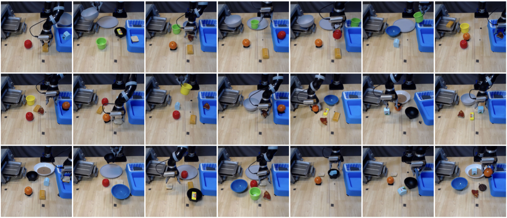

# CLVR Jaco Play Dataset

[](https://colab.research.google.com/drive/1GC6LHTSMGufMkHfeAw5Ne3sQFViT_FL6?usp=sharing)

[Shivin Dass](https://shivindass.github.io/)<sup>1</sup>, [Jullian Yapeter](https://jullianyapeter.com/)<sup>1</sup>, 
[Jesse Zhang](https://jesbu1.github.io/)<sup>1</sup>, [Jiahui Zhang](https://jiahui-3205.github.io/)<sup>1</sup>,
[Karl Pertsch](https://kpertsch.github.io/)<sup>1</sup>, [Stefanos Nikolaidis](https://stefanosnikolaidis.net/)<sup>1</sup>, 
[Joseph J. Lim](https://www.clvrai.com/)<sup>1,2</sup>

<sup>1</sup>University of Southern California
<sup>2</sup>KAIST

<p align="center">

</img></p>


The `CLVR Jaco Play Dataset` consists of **1085 teleoperated robot episodes**, including language annotations.
Please find details for loading and using the data below and in the provided [Colab](https://colab.research.google.com/drive/1GC6LHTSMGufMkHfeAw5Ne3sQFViT_FL6?usp=sharing).

For further questions, please contact `{sdass, pertsch}@usc.edu`.

## Downloading the Data

Please install [gdown](https://github.com/wkentaro/gdown) (`pip install gdown`) and run the provided download script.
```
bash download_jaco_data.sh ./data
```
Alternatively, you can manually download the data from 
[this link](https://drive.google.com/file/d/1tVSilmXhyQd8gxZAEhvKMnynw0qzRFSZ/view?usp=share_link) (~16GB).
We found manual download to be faster in some cases.

## Using the Data
Please check out our [Colab](https://colab.research.google.com/drive/1GC6LHTSMGufMkHfeAw5Ne3sQFViT_FL6?usp=sharing) for an example how to unpack and use the data!

The dataset has the following structure:

- Observations are split into 5 attributes,
    - **front_cam_ob** : observations from 3rd person cam
    - **mount_cam_ob** : observations from mounted camera
    - **ee_cartesian_pos_ob** : end effector cartesian position. ee_cartesian_pos_ob[0:3] corresponds to position and ee_cartesian_pos_ob[3:7] corresponds to orientation in quarternian format
    - **ee_cartesian_vel_ob** : end effector cartesian velocity. ee_cartesian_pos_ob[0:3] corresponds to change in position and ee_cartesian_pos_ob[3:6] corresponds to change in orientation in roll, pitch yaw format
    - **joint_pos_ob** : joint positions of the jaco arm (we only use the last 2 elements of this that correspond to the gripper joints)
- **actions** : first 3 elements are cartesian deltas and 4th element is a label from {0, 1, 2} meaning {open gripper, don't move gripper, close gripper}
- **terminals** : 1 at the end of each skill
- **prompts** : Natural language description of the goal
- **reward** : 1 at the end of each skill

## Citation

If you find this work useful in your research, please consider citing:
```
@software{dass2023jacoplay,
  author = {Dass, Shivin and Yapeter, Jullian and Zhang, Jesse and Zhang, Jiahui
            and Pertsch, Karl and Nikolaidis, Stefanos and Lim, Joseph J.},
  title = {CLVR Jaco Play Dataset},
  url = {https://github.com/clvrai/clvr_jaco_play_dataset},
  version = {1.0.0},
  year = {2023}
}
```

## License

The data is available under the [Creative Commons Attribution 4.0 International License](https://creativecommons.org/licenses/by/4.0/).
